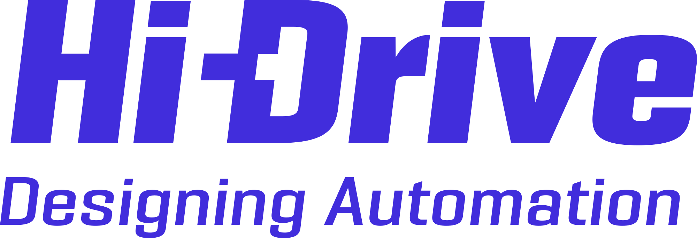

# simple-simulation

Execute simulation runs defined by [simple-scenario](https://github.com/ika-rwth-aachen/simple-scenario) for developing test scenario selection algorithms and testing prototype automated driving systems.

# Notice

> [!IMPORTANT]
> This repository is open-sourced and maintained by the [**Institute for Automotive Engineering (ika) at RWTH Aachen University**](https://www.ika.rwth-aachen.de/).
> We cover a wide variety of research topics within our [*Vehicle Intelligence & Automated Driving*](https://www.ika.rwth-aachen.de/en/competences/fields-of-research/vehicle-intelligence-automated-driving.html) domain.
> If you would like to learn more about how we can support your automated driving or robotics efforts, feel free to reach out to us!
> :email: ***opensource@ika.rwth-aachen.de***


# Install

To use or develop `simple-simulation`, you must first clone the repository.

```bash
$ git clone git@gitlab.ika.rwth-aachen.de:fb-fi/simulation/simple-simulation/simple-simulation.git
$ cd simple-simulation
```

It is recommended to use [uv](https://docs.astral.sh/uv/getting-started/installation/) for package management. If you do not want to use `uv`, please consult the [Without uv](#without-uv) section.

## With uv

Install requirements with

```bash
$ uv sync
```

To run a script, use

```bash
$ uv run /path/to/script.py
```

or directly use the python interpreter from the `.venv` folder in e.g. VSCode.

To run the tests, install the dev requirements with

```bash
$ uv sync --dev
```

and run the tests

```bash
$ uv run pytest
```

## Without uv

Install the project editable

```bash
$ python -m pip install -e .
```

To run the tests, first install pytest

```bash
$ python -m pip install pytest
```

and run

```bash
$ pytest
```
# Use

:bulb: You should first complete the [Installation](#install).

Run some simulations

1. Open the file `test/test_challenger_a.py` and run it by clicking on the run arrow in the top right corner.

2. There should be some videos in the folder `test/test_results/challenger_a/`.

You can watch them directly in VSCode.

# Dev

The following lists the main idea of the modules:

* `simulation_manager/`: Main module handling all other modules to run the main simulation loop.
* `pilots/`: Pilots for the simulation actors. A pilot takes high-level decisions for lateral and longitudinal control for exactly one simulation actor based on the current situation in the simulation. Each pilot must be a subclass of `Pilot` in `pilots/pilot.py`.
* `pilots/mpc_controller.py`: An mpc controller that is used by the `HighwayPilot` for making sure that the controlled vehicle will follow the reference trajectory.
* `simulation_core/`: The lightweight simulation core using [CommonRoad vehicle models](https://gitlab.lrz.de/tum-cps/commonroad-vehicle-models).

# Acknowledgements

This package is developed as part of the [Hi-Drive project](https://www.hi-drive.eu).

<!--  -->


The research leading to these results has received funding from the European Union’s Horizon 2020 research and innovation programme under grant agreement No 101006664.
The sole responsibility of this publication lies with the authors.
The authors would like to thank all partners within the Hi-Drive project (hi-drive.eu) for their cooperation and valuable contribution.

<!--  -->

